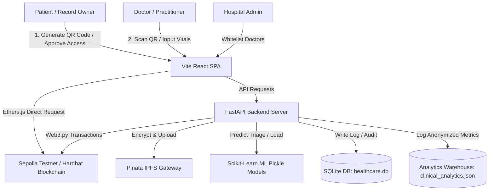

# MediChain Intelligence (Blockchain Healthcare & Clinical Triage System)

MediChain Intelligence is an India-ready, privacy-first, decentralized digital health platform designed to securely manage, share, and analyze clinical records. By leveraging a hybrid architecture combining Ethereum/Sepolia blockchain, IPFS (InterPlanetary File System), and machine learning analytics, MediChain enforces strict consent-driven clinical record sharing while enabling real-time facility resource optimization.

---

## 📖 Table of Contents
1. [Fundamentals & Core Concepts](#1-fundamentals--core-concepts)
2. [System Architecture & Hybrid Design](#2-system-architecture--hybrid-design)
3. [Core Workflows (End-to-End)](#3-core-workflows-end-to-end)
4. [Smart Contract Technical Deep Dive (`HealthcareRecords.sol`)](#4-smart-contract-technical-deep-dive-healthcarerecordssol)
5. [Backend API Architecture (FastAPI)](#5-backend-api-architecture-fastapi)
6. [Machine Learning Engine & Predictive Models](#6-machine-learning-engine--predictive-models)
7. [Security, Cryptography & Privacy Controls](#7-security-cryptography--privacy-controls)
8. [Database Schemas & Data Storage Layout](#8-database-schemas--data-storage-layout)
9. [Frontend Client Application (React + Vite)](#9-frontend-client-application-react--vite)
10. [Deployment & Configuration Guide](#10-deployment--configuration-guide)
11. [RAG Engine Quick Reference & Keyword Index](#11-rag-engine-quick-reference--keyword-index)

---

## 1. Fundamentals & Core Concepts

### Why Blockchain in Healthcare?
Modern healthcare data exchange suffers from fragmentation, lack of patient-controlled authorization, vulnerability to tampering, and compliance risks. MediChain utilizes blockchain technology to:
* **Enforce Integrity:** Prevent tampering or retroactive alterations of clinical records by storing cryptographic audit trails on-chain.
* **Consent Management:** Ensure patients remain the absolute owners of their records. Access is only possible if the patient actively approves an on-chain grant of permission.
* **Interoperability:** Build a unified registry where multiple hospitals, clinics, and pharmacies can query records without maintaining single-point-of-failure databases.

### Solving the Trilemma of Security, Speed, and Privacy
Directly storing files on a public blockchain is prohibitively expensive (due to gas fees) and violates privacy regulations (such as GDPR, HIPAA, and ABDM - Ayushman Bharat Digital Mission) because data on a public ledger is viewable by all nodes and cannot be deleted. 

MediChain implements a **hybrid architecture**:
1. **Clinical Payload (Off-chain):** Clinical notes, prescriptions, and file attachments are symmetrically encrypted using AES-128-CBC and uploaded to IPFS.
2. **Consent & Citations (On-chain):** The blockchain stores only the cryptographic hashes of the patient's identity (Aadhaar SHA-256) and the IPFS CID (Content Identifier) pointers. 

---

## 2. System Architecture & Hybrid Design



### Component Details
* **Vite React Frontend:** Accessible via browser, integrated with MetaMask for administrator signing and doctor wallet whitelist verifications. Employs `html5-qrcode` to scan patient identity QR codes.
* **FastAPI Backend (Python):** Orchestrates API routes, manages cryptography, interfaces with machine learning models, caches IPFS downloads, and operates SQLite and local analytics warehouses.
* **Web3/Smart Contract Layer:** Written in Solidity (`^0.8.19`), compiled and managed via Hardhat, and deployed to either Sepolia Testnet or a local Hardhat Node. Uses `web3.py` on the backend and `ethers.js` on the frontend.
* **Decentralized Storage Layer:** Pinata-managed IPFS pinning service. Integrates a local fallback cache (`data/ipfs_cache.json`) for prototype/offline execution.
* **AI/ML Engine:** Off-line trained Random Forest classifiers and regressors used in real-time by the FastAPI server to predict clinical risk levels (Triage) and forecast facility load (Queue management).

---

## 3. Core Workflows (End-to-End)

### A. Patient Registration & Login
1. The patient enters their 12-digit Aadhaar number and a 6-digit PIN.
2. The frontend POSTs to `/auth/login`.
3. The backend generates a deterministic SHA-256 hash of the Aadhaar number:
   $$\text{Patient Hash} = \text{0x} + \text{SHA256}(\text{Aadhaar})$$
4. This hash becomes the patient's unique system identifier, preventing the storage of raw Aadhaar numbers (PII) on the public blockchain or local databases.
5. The API returns a session token stored in the browser's `localStorage`.

### B. Consent Acquisition (QR Code + OTP Flow)
1. The patient dashboard displays a QR code encoding their patient hash.
2. A doctor initiates a request by scanning the QR code or manually typing the hash.
3. The doctor's MetaMask wallet address is whitelisted by the hospital admin.
4. The doctor signs a request transaction on the blockchain (`requestAccess`).
5. A mock OTP is triggered. The patient approves the doctor's address on their dashboard.
6. The backend signs the `approveAccess` transaction on the blockchain from the Hospital wallet.
7. The doctor is now authorized to view historical entries and submit new medical records.

### C. Clinical Record Upload & Security
1. The doctor submits patient vitals (Heart Rate, Blood Pressure, SpO2, Temperature, Age, Gender), diagnosis notes, and optional file attachments.
2. **Symmetric Encryption:** The backend processes the upload:
   * Compiles JSON metadata (vitals, diagnoses).
   * Encrypts the raw attachment file using Fernet (AES-128-CBC with HMAC-SHA256).
   * Encrypts the JSON metadata bundle.
   * Concatenates the payloads with a special separator:
     $$\text{Payload} = \text{Encrypted File} + \text{"|||SEPARATOR|||"} + \text{Encrypted Metadata}$$
3. **Decentralized Storage:** The concatenated byte stream is sent to Pinata IPFS, returning a CID.
4. **On-Chain Audit:** The backend triggers a transaction `addMedicalRecord(patient_hash, IPFS_CID)` on the `HealthcareRecords` contract using the hospital's private key.
5. **Anonymized Analytics Warehouse:** To support dashboard analysis without breaching confidentiality:
   * The vitals and demographics are logged into `clinical_analytics.json` with all PII (Aadhaar, names, wallet keys) stripped.
   * The AI model runs a classification check to evaluate the triage priority (Level 2, 3, or 5).

---

## 4. Smart Contract Technical Deep Dive (`HealthcareRecords.sol`)

The system's blockchain logic is encapsulated within `HealthcareRecords.sol` (located in `blockchain/contracts/`). It is optimized to support hospital-managed records where write and configuration actions are restricted to the deploying authority (the hospital), while patient access controls remain strict.

### Data Structures & State Variables

```solidity
address public hospital; // Deploying authority address

struct Access {
    uint40 expiry; // Unix timestamp for access expiration
    bool granted;  // Access authorization status
}

struct Record {
    uint40 timestamp; // Block timestamp of addition
    string ipfsHash;  // IPFS Content Identifier (CID)
}
```
* **Gas Optimizations:** The `Access` and `Record` structs pack the timestamps/expiries as `uint40` (which supports timestamps up to the year 34,865) instead of standard `uint256`. This allows EVM to store the structures in a single 32-byte storage slot, saving significant gas.

### Key Mappings
1. `mapping(bytes32 => Record[]) public patientRecords;`
   Maps the `keccak256` SHA-256 hash of a patient's Aadhaar to their array of on-chain record CIDs.
2. `mapping(bytes32 => mapping(address => Access)) public doctorAccess;`
   Maps a patient's identity hash to a doctor's wallet address, checking if access has been granted and its expiration date.
3. `mapping(address => bool) public doctorWhitelist;`
   Maps doctor wallet addresses to a whitelisted status. Only whitelisted doctor wallets can call contract functions.
4. `mapping(bytes32 => mapping(address => bool)) public pendingRequests;`
   Tracks active permission requests initiated by doctors awaiting patient approval.

### Functions & Access Rules

#### 1. `setDoctorWhitelist(address _doctor, bool _status)`
* **Access:** `onlyHospital` (restricts execution to the contract deployer).
* **Purpose:** Whitelists or revokes a doctor's MetaMask address, allowing or blocking them from calling system methods.

#### 2. `requestAccess(bytes32 _patientHash)`
* **Access:** Restricted to whitelisted doctor addresses.
* **Purpose:** Sets the `pendingRequests` status for the given patient hash to `true`. Emits an `AccessRequested` event.

#### 3. `approveAccess(bytes32 _patientHash, address _doctor, uint _expiry)`
* **Access:** `onlyHospital`.
* **Purpose:** Called by the backend when the patient authorizes the request in the UI. Sets the `Access` struct fields (`granted = true` and `expiry = uint40(_expiry)`). Marks the pending request as `false`. Emits `AccessGranted`.

#### 4. `addMedicalRecord(bytes32 _patientHash, string memory _ipfsHash)`
* **Access:** `onlyHospital`.
* **Purpose:** Pushes a new `Record` containing the current block timestamp and the IPFS CID into the patient's record array. Emits `RecordAdded`.

#### 5. `hasAccess(bytes32 _patientHash, address _doctor) public view returns (bool)`
* **Purpose:** Checks if the caller is the hospital (always returns `true`) or if the doctor holds a valid, non-expired `Access` token.
* **Logic:**
  ```solidity
  return access.granted && (access.expiry == 0 || block.timestamp < access.expiry);
  ```

#### 6. `getPatientRecords(bytes32 _patientHash) public view returns (Record[] memory)`
* **Access:** Restricted to the hospital address or doctors passing the `hasAccess` check.
* **Purpose:** Returns the array of `Record` structures containing IPFS CIDs and timestamps.

---

## 5. Backend API Architecture (FastAPI)

The backend (`backend/app/main.py`) acts as the secure middleware. It manages MetaMask/Aadhaar authentication sessions, interfaces with the local SQLite DB (`healthcare.db`), implements local IPFS caching, and performs encryption.

### Key API Endpoints

| Method | Endpoint | Auth | Request Body | Description |
| :--- | :--- | :--- | :--- | :--- |
| **POST** | `/auth/login` | None | `{ "aadhaar": "...", "pin": "...", "role": "patient/doctor" }` | Validates ID and PIN, registers a session token, and returns the deterministic user hash. |
| **GET** | `/auth/session` | Header | None | Validates current `Bearer` session token and returns user details. |
| **POST** | `/auth/whitelist` | None | `{ "doctor_address": "0x..." }` | Calls the smart contract via `web3.py` to whitelist a doctor wallet. |
| **POST** | `/records/submit` | None | Form-Data: `patient_hash`, `doctor_address`, `vitals_json`, `file` | Symmetrically encrypts JSON and attachments, posts to IPFS, logs anonymized analytics, and adds the CID to the blockchain. |
| **GET** | `/records/{aadhaar}` | None | Path Parameter (Aadhaar or `0x` Hash) | Fetches CIDs from the blockchain, downloads encrypted data from IPFS, decrypts payload, and returns historical records. |
| **POST** | `/access/request` | None | `{ "patient_hash": "...", "doctor_address": "0x..." }` | Records a pending permission request in backend memory. |
| **GET** | `/access/pending/{hash}`| None | Path Parameter (Patient Hash) | Used by patient portal polling to display pending authorization requests. |
| **POST** | `/access/approve` | None | `{ "patient_hash": "...", "doctor_address": "0x..." }` | Executes an on-chain transaction calling `approveAccess` on the contract from the hospital wallet. |
| **GET** | `/admin/dashboard` | None | None | Generates statistical aggregations from `clinical_analytics.json` for the Recharts administrator view. |

---

## 6. Machine Learning Engine & Predictive Models

The machine learning subsystem (located in `ml/`) contains pre-trained models used by the backend to support administrative decisions and patient safety.

```
ml/
├── data/
│   ├── triage_data.csv       # Synthetic clinical metrics training set
│   └── hospital_load.csv     # Synthetic scheduling inflow training set
├── train_models.py           # Training script for Scikit-Learn pipelines
├── triage_model.pkl          # Pickled Random Forest Classifier
└── load_model.pkl            # Pickled Linear Regression Model
```

### A. Patient Triage Model (`triage_model.pkl`)
* **Type:** Random Forest Classifier (100 Estimators) trained on features: `age`, `heart_rate` (bpm), `oxygen_level` (SpO2 %), `temperature` (°C), and a clinical `symptom_score` (1-10 scale).
* **Objective:** Predicts patient acuity to optimize Emergency Room queuing.
* **Classes:**
  * `0`: Low Risk (Stable)
  * `1`: Medium Risk (Urgent)
  * `2`: High Risk (Critical)
* **API Integration:** Implemented in `ml_service.predict_triage()`. If the model is not loaded, it falls back to a rule-based scoring system:
  $$\text{Score} = \left(\frac{\text{HR}}{140} \times 0.2\right) + \left(\frac{100 - \text{SpO2}}{15} \times 0.4\right) + \left(\frac{\text{Temp} - 36}{4} \times 0.2\right) + \left(\frac{\text{Symptom}}{10} \times 0.2\right)$$
  * Score $< 0.35 \rightarrow$ Low Risk
  * Score $< 0.65 \rightarrow$ Medium Risk
  * Score $\ge 0.65 \rightarrow$ High Risk

### B. Hospital Load Forecasting Model (`load_model.pkl`)
* **Type:** Linear Regression Model trained on features: `hour` (0-23) and `day` (0-6 representation of weekday).
* **Objective:** Predicts the expected volume of incoming patients to adjust staffing requirements.
* **API Integration:** Implemented in `ml_service.predict_load()`. It yields hourly predictions for the upcoming week (`predict_load_week()`), enabling the admin dashboard to project peaks.

---

## 7. Security, Cryptography & Privacy Controls

MediChain operates a multi-layered security protocol designed to satisfy medical confidentiality standards:

### 1. Data at Rest (Symmetric Cryptography)
All patient records are encrypted before leaving the server.
* **Technology:** Pyca/Cryptography `Fernet` (implements AES-128 in CBC mode with an RFC 1411-compliant PBKDF2 HMAC-SHA256 signature for integrity validation).
* **Key Lifecycle:** The backend searches for an environment variable `ENCRYPTION_KEY`. If not defined, it generates a cryptographically secure key at runtime using `Fernet.generate_key()`.
* **Payload Isolation:** File attachments are encrypted separately from patient vital metadata. They are uploaded together inside a split byte bundle separated by `|||SEPARATOR|||`, preventing metadata leakage even if file contents are compromised.

### 2. Identity Security (Aadhaar Hashing)
Raw Aadhaar numbers are immediately converted into hashes:
$$\text{Patient Hash} = \text{0x} + \text{SHA256}(\text{Aadhaar})$$
No database, transaction log, smart contract, or IPFS metadata contains the plain 12-digit Aadhaar. This makes it impossible for an attacker viewing the public blockchain to correlate a transaction history with a physical individual.

### 3. Role-Based Access Control (RBAC)
The frontend enforces roles inside dashboards to regulate screen privileges:
* **Patients:** Can view only their own records and authorize access requests.
* **Doctors (Surgeons/General):** Can request access, view authorized clinical histories, and append new vitals, diagnoses, and lab reports.
* **Doctors (Pharmacists):** Can view decrypted prescriptions but are restricted from writing clinical diagnoses or records.
* **Admins:** Can whitelist doctor wallet addresses and monitor anonymized analytics charts, but cannot view individual patient health files.

---

## 8. Database Schemas & Data Storage Layout

### A. SQL Database Layout (`healthcare.db` - SQLite)
Managed by SQLAlchemy inside `backend/app/database.py` with three core tables:

#### 1. Table: `patient_records`
Stores local reference keys and metadata for uploaded records.
* `id` (INTEGER, Primary Key)
* `patient_address` (VARCHAR, Index) - SHA-256 Patient Hash
* `ipfs_hash` (VARCHAR) - IPFS CID
* `risk_category` (VARCHAR) - ML-predicted triage category
* `icu_probability` (FLOAT) - Calculated probability of ICU admission
* `age` (INTEGER), `heart_rate` (INTEGER), `oxygen_level` (INTEGER), `temperature` (FLOAT), `symptom_score` (INTEGER)
* `file_name` (VARCHAR, Nullable) - Name of attached clinical file
* `tx_hash` (VARCHAR, Nullable) - Sepolia transaction hash
* `created_at` (DATETIME) - Creation timestamp

#### 2. Table: `access_logs`
Audit trails of consent operations.
* `id` (INTEGER, Primary Key)
* `patient_address` (VARCHAR, Index) - Patient Hash
* `doctor_address` (VARCHAR, Index) - Doctor's wallet address
* `action` (VARCHAR) - Consent states: `requested`, `granted`, or `revoked`
* `timestamp` (DATETIME) - Action timestamp

#### 3. Table: `alerts`
Real-time triage warnings.
* `id` (INTEGER, Primary Key)
* `message` (VARCHAR) - Detailed notification message
* `alert_type` (VARCHAR) - `critical`, `warning`, or `info`
* `acknowledged` (BOOLEAN) - Status flag
* `created_at` (DATETIME) - Creation timestamp

### B. Anonymized Data Warehouse (`clinical_analytics.json`)
Saves clinical vital statistics used to compile analytics charts. All identifiers are stripped.
```json
[
  {
    "timestamp": "2026-07-19T20:45:00.123456",
    "age": 45,
    "gender": "Male",
    "hr": 82,
    "bp": "120/80",
    "o2": 96,
    "temp": 37.2,
    "diagnosis": "Type E11.9 (Type 2 Diabetes)",
    "medications": "Metformin 500mg",
    "triage_score": 3
  }
]
```

### C. Local IPFS Mock Cache (`data/ipfs_cache.json`)
Stores simulation fallbacks to guarantee offline prototype compatibility without Pinata keys.
* **Structure:** `{ "ipfs_cid_or_mock_hash": { "vitals_data_object" } }`

---

## 9. Frontend Client Application (React + Vite)

The UI is a modern, responsive Single Page Application (SPA) designed to reflect clinical operational panels.

### Component Structure
* **`App.jsx`:** Directs routing, stores active user profiles in state, and sets a warning listener (`beforeunload`) to alert users that active clinical inputs will be lost upon browser refresh.
* **`Login.jsx`:** Dual-pane layout dividing Patient Aadhaar/PIN inputs and Practitioner specialization settings. Incorporates an "Admin Login" trigger that initiates MetaMask wallet checks.
* **`Layout.jsx` / `Navbar`:** Manages page layout tabs dynamically adjusted based on the authenticated role:
  * **Patient Tabs:** `My Records`, `AI Analysis`, `Access Control`
  * **Doctor Tabs:** `Triage Queue`, `Patient Records`, `AI Assistant`
  * **Admin Tabs:** `Dashboard`, `Analytics`, `Alerts`
* **`PatientDashboard.jsx`:** Generates QR codes via the QR Server API, queries decrypted clinical timelines, and displays pulsing warnings for pending doctor access approvals.
* **`DoctorDashboard.jsx`:** Integrates the QR Scanner interface, processes forms in step-by-step wizards, and blocks input functions for Pharmacist Specializations.
* **`AdminDashboard.jsx`:** Rendered using Recharts components:
  * `AreaChart` (Throughput monitoring)
  * `RadarChart` (Department activity analysis)
  * `BarChart` (Vital pulse metrics)
  * `ScatterChart` (SpO2/Heart Rate correlation plots)
  * `PieChart` (Triage Risk Stratification metrics)

---

## 10. Deployment & Configuration Guide

### Environment Variables (`.env`)

#### Backend (`backend/.env`):
```ini
# Sepolia Testnet RPC Provider (Infura/Alchemy)
SEPOLIA_RPC_URL=https://sepolia.infura.io/v3/YOUR_PROJECT_ID

# Deploying Hospital wallet private key (Requires Sepolia ETH)
HOSPITAL_PRIVATE_KEY=your_private_key_here

# Deployed Smart Contract Address
VITE_CONTRACT_ADDRESS=0x9D54eE261aA4f574D6e2A9CDD1d02eBA5A1C9B13

# Pinata IPFS Credentials (Leave blank for Simulation Mode)
PINATA_API_KEY=
PINATA_SECRET_KEY=

# Server Configuration
PORT=8080
NODE_ENV=development
```

#### Frontend (`frontend/.env`):
```ini
VITE_API_URL=http://127.0.0.1:8080
VITE_CONTRACT_ADDRESS=0x9D54eE261aA4f574D6e2A9CDD1d02eBA5A1C9B13
VITE_CHAIN_ID=11155111
```

### Scripted Setup (Windows PowerShell)
The project provides a one-click deployment script `setup_all.ps1` at the root directory:
1. Open PowerShell as Administrator.
2. Navigate to the project root directory.
3. Run the script:
   ```powershell
   ./setup_all.ps1
   ```
This script handles dependency installation (Python requirements, node packages), compiles Hardhat contracts, runs the Uvicorn backend server on port `8080`, and fires up the Vite frontend on port `5173`.

### Manual CLI Setup

#### 1. Compile & Deploy Smart Contracts:
```bash
cd blockchain
npm install
npx hardhat compile
# (Optional) Deploy command if updating network
npx hardhat run scripts/deploy.js --network sepolia
```

#### 2. Run Python Backend:
```bash
cd backend
pip install -r requirements.txt
python -m uvicorn app.main:app --reload --host 0.0.0.0 --port 8080
```

#### 3. Run React Frontend:
```bash
cd frontend
npm install
npm run dev
```

---

## 11. RAG Engine Quick Reference & Keyword Index

For context-matching in Retrieval-Augmented Generation systems, use this key-value index:

* **Blockchain Networks:** Sepolia (Chain ID `11155111`), Hardhat Local (Chain ID `31337`).
* **Symmetric Encryption Key variable:** `ENCRYPTION_KEY` (Fernet base64-encoded).
* **Salt/Hash Prefix:** `0x` is prefixed to the SHA-256 Aadhaar hashes.
* **Default API Port:** `8080` (FastAPI).
* **Default App Port:** `5173` (Vite React).
* **Decentralized Storage:** Pinata IPFS API (`https://api.pinata.cloud/pinning/pinFileToIPFS`).
* **Active Smart Contract Address (Sepolia):** `0x9D54eE261aA4f574D6e2A9CDD1d02eBA5A1C9B13`
* **Local Database Name:** `healthcare.db` (SQLite).
* **Analytics Cache File:** `data/clinical_analytics.json`.
* **Mock IPFS File:** `data/ipfs_cache.json`.
* **ML Model Training Script:** `ml/train_models.py`.
* **Triage Classifier File:** `ml/triage_model.pkl`.
* **Load Forecaster File:** `ml/load_model.pkl`.
* **Triage Features:** Age, Heart Rate (`heart_rate`), Oxygen Level (`oxygen_level`), Temperature (`temperature`), Symptom Score (`symptom_score`).
* **Load Predictor Features:** Hour (`hour`), Weekday (`day`).
* **Contract Deployer Address Role:** `hospital` (sole modifier checks).
* **Regulatory Compliance Specs:** ABDM (Ayushman Bharat Digital Mission), HIPAA (Health Insurance Portability and Accountability Act), GDPR (General Data Protection Regulation).
* **Core React Hooks:** `useHealthcare` (API routes integration), `useContract` (Local contract MetaMask interactions).
